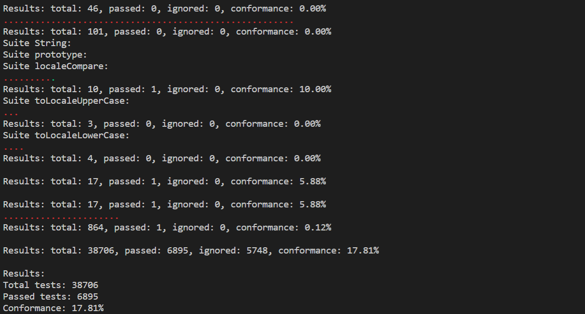

Boa is an experimental Javascript lexer, parser and compiler written in Rust. It has support for some of the language, can be embedded in Rust projects fairly easily and also used from the command line.
Boa also exists to serve as a Rust implementation of the EcmaScript specification, there will be areas where we can utilise Rust and its fantastic ecosystem to make a fast, concurrent and safe engine.

We have a long way to go, however v0.10 has been the biggest release to date, with 138 issues closed!

We have some highlights, but if you prefer to read the full changelog, you can do that [here](https://github.com/boa-dev/boa/blob/main/CHANGELOG.md)

## Test262

One question we've been asked for a long time is "how conformant are you to the spec?". It's been tough to answer as we've been unable to run against the official test suite.

Test262 is the official ECMAScript Test Suite and exists to provide conformance tests for the latest drafts of the Ecma specification. It is used for all engines, you can even run it in your [browser](https://bakkot.github.io/test262-web-runner/).  
Thanks to @Razican in v0.10 we now have a test harness that allows us to run it against Boa at any time.

This is a new crate inside the Boa repository that can parse through all of the tests (roughly 40,000 of them) in under 10 minutes and tell us how conformant we are.

Today Boa has 18% conformity to the specification. We'll be keeping an eye on this number over the releases. We expect to achieve around 30% by 0.11 due to some of the fixes we're adding which should pass a few thousand tests.

These are run via Github Actions against PRs and for our main branch so that we can keep track of where we are and if there are regressions.

## Built-ins

We've added support for [`Date`](https://developer.mozilla.org/en-US/docs/Web/JavaScript/Reference/Global_Objects/Date), [`Map`](https://developer.mozilla.org/en-US/docs/Web/JavaScript/Reference/Global_Objects/Map) and [well-known symbols](https://developer.mozilla.org/en-US/docs/Web/JavaScript/Reference/Global_Objects/Symbol). Supporting Well-known symbols unblocks a lot of work around adding `@@iterators` to some of our global objects which is coming up in the next release.  
Both `Math` and `Number` have had their remaining methods implemented.

## Lexer

The lexer has been rebuilt from scratch. Just like the old parser it was a single file before looping through and becoming unmaintainable. Today we've reorganised it into separate modules which know how to lex certain areas. The new lexer [now supports goal symbols](https://github.com/boa-dev/boa/issues/294) and can now tokenize with the correct context at any time.

### Goal Symbols

Our issue with goal symbols is explained by the V8 team:
<https://v8.dev/blog/understanding-ecmascript-part-3#lexical-grammar>

Previously we weren't distinguishing between the contexts where some input elements are permitted and some are not, so lexing `/` would yeild a `division` symbols when it should be a `RegularExpressionLiteral` for example. This change unblocked us being able to run Test262.

Performance wise it is much faster for larger files. The lexer is far more efficient at streaming tokens to the parser than previously so in some scenarios we have big gains.

_You can see all the benchmarks [here](https://boa-dev.github.io/boa/dev/bench/)_

## Repl syntax highlighting

Syntax highlighting was added to the repl this release thanks to @HalidOdat  
Our repl is made possible due to the great work of [RustyLine](https://github.com/kkawakam/rustyline)

## Looking forward

There are plenty of fixes and performance changes still needed, we also hope to experiment with producing Bytecode from our AST in future. Test262 coverage will almost certainly increase, and we are polishing the public API for easier use when embedding into other Rust projects.

Thanks to all those who contributed to 0.10, you can see the names in the full changelog linked above.

You can checkout Boa via [Github](https://github.com/boa-dev/boa) or on [crates.io](https://crates.io/crates/Boa)
